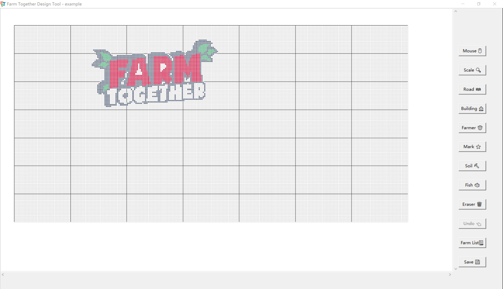

# 预览截图 Preview  
  

# 环境依赖 Environment  
+ python3 (3.8.13)

# 安装 Installation  
### 1）下载运行py文件
1. 克隆此仓库  
    ```
    git clone https://github.com/V7T9/FarmTogetherDesignTool.git
    cd FarmTogetherDesignTool
    ```  
2. 运行```ftdt.py```     
   ```
   python ftdt.py
   ```
### 2）Or直接下载运行ftdt.exe  
windows用户可以尝试直接下载[releases](https://github.com/V7T9/FarmTogetherDesignTool/releases)中打包好的FTDT.rar，解压后双击运行ftdt.exe   

# 如何使用 How to use  
视频 - [【FarmTogether】告别Excel，用FTDT设计农场布局](https://www.bilibili.com/video/BV1hD4y117JC/)  